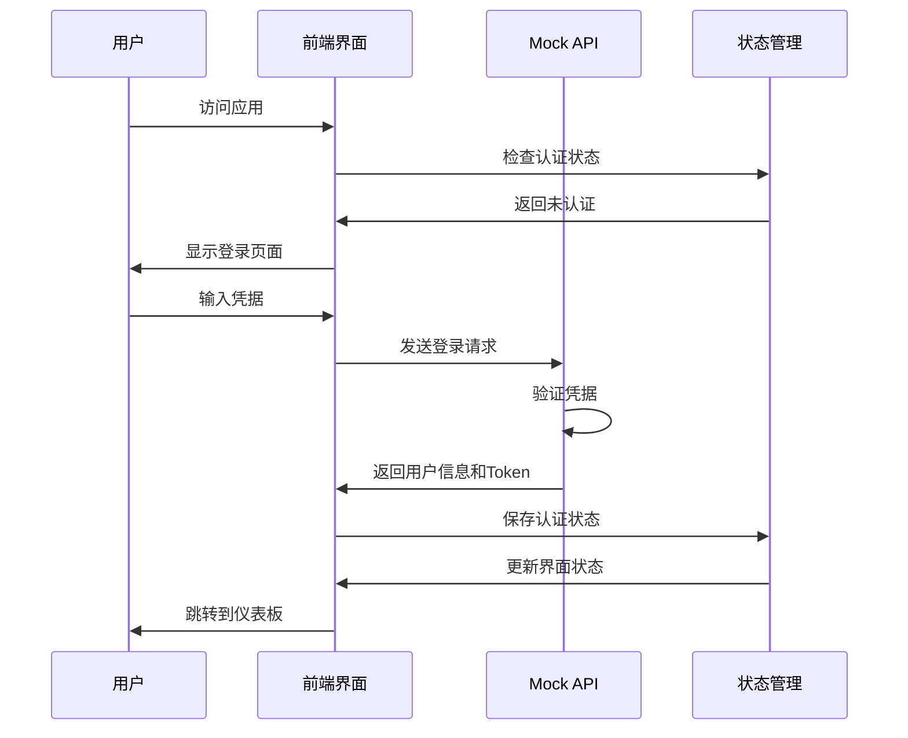
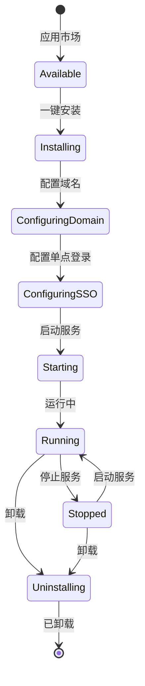

# MixBox 用户端系统架构设计文档

## 1. 项目概述

### 1.1 产品定位
MixBox 用户端是一个面向小白用户和 NAS 入门玩家的自托管容器管理平台。用户通过现代化的 Web 界面，可以一键安装和管理各种应用服务，系统自动处理域名分配、SSL证书、单点登录等复杂配置。

### 1.2 设计目标
- **极简操作**: 复杂的技术配置对用户透明，实现一键安装和使用
- **现代化界面**: 采用最新的设计趋势，提供优秀的用户体验
- **零技术门槛**: 面向非技术用户，无需了解 Docker、域名解析等概念
- **完全前端**: 当前阶段使用 Mock 数据，便于后期集成真实后端

### 1.3 目标用户
- NAS 入门用户
- 小白级别的自托管爱好者
- 想要简单管理容器服务的用户
- 对技术细节不感兴趣但需要功能的用户

## 2. 系统架构设计

### 2.1 整体架构
```
┌─────────────────────────────────────────────────────────────┐
│                    MixBox 用户端架构                          │
├─────────────────────────────────────────────────────────────┤
│  Frontend (Next.js 14)                                    │
│  ┌─────────────────┐ ┌─────────────────┐ ┌─────────────────┐ │
│  │   UI 组件层      │ │   页面路由层     │ │   状态管理层     │ │
│  │  - Shadcn/UI   │ │  - App Router   │ │  - Zustand     │ │
│  │  - Tailwind    │ │  - 多语言路由    │ │  - TanStack    │ │
│  │  - Framer      │ │  - 中间件       │ │    Query       │ │
│  └─────────────────┘ └─────────────────┘ └─────────────────┘ │
├─────────────────────────────────────────────────────────────┤
│  Mock API Layer (MSW)                                     │
│  ┌─────────────────┐ ┌─────────────────┐ ┌─────────────────┐ │
│  │  官方服务 Mock   │ │  本地服务 Mock   │ │  实时数据模拟   │ │
│  │  - 用户认证     │ │  - 容器管理     │ │  - WebSocket    │ │
│  │  - 域名分配     │ │  - 应用市场     │ │  - Server-Sent  │ │
│  │  - DDNS 服务    │ │  - OIDC 管理    │ │    Events       │ │
│  └─────────────────┘ └─────────────────┘ └─────────────────┘ │
├─────────────────────────────────────────────────────────────┤
│  Data Layer                                                │
│  ┌─────────────────┐ ┌─────────────────┐ ┌─────────────────┐ │
│  │   Mock 数据源    │ │   本地存储      │ │   会话管理      │ │
│  │  - 用户数据     │ │  - LocalStorage │ │  - Session      │ │
│  │  - 应用目录     │ │  - IndexedDB    │ │    Storage      │ │
│  │  - 系统配置     │ │  - WebSQL       │ │  - Cookies      │ │
│  └─────────────────┘ └─────────────────┘ └─────────────────┘ │
└─────────────────────────────────────────────────────────────┘

External Dependencies:
┌─────────────────┐     ┌─────────────────┐
│  MixBox 官方服务  │ ←→  │  真实后端服务    │
│  (Future)       │     │  (Future)      │  
└─────────────────┘     └─────────────────┘
```

### 2.2 技术栈选择

#### 2.2.1 前端框架
- **Next.js 14**: 
  - App Router 提供现代化的路由系统
  - Server Components 优化性能
  - 内置 TypeScript 支持
  - 优秀的开发体验

#### 2.2.2 UI 框架
- **Shadcn/UI**: 
  - 基于 Radix UI 的现代化组件库
  - 完全可定制的组件
  - 内置无障碍访问支持
  - TypeScript 原生支持

- **Tailwind CSS**:
  - 实用优先的 CSS 框架
  - 响应式设计支持
  - 深色模式支持
  - 高度可定制

- **Framer Motion**:
  - React 动画库
  - 流畅的页面转场
  - 微交互动画
  - 手势支持

#### 2.2.3 状态管理
- **Zustand**: 
  - 轻量级状态管理
  - TypeScript 友好
  - 简单的 API 设计
  - 无样板代码

- **TanStack Query**:
  - 服务端状态管理
  - 自动缓存和同步
  - 错误处理和重试
  - 乐观更新

#### 2.2.4 Mock 系统
- **Mock Service Worker (MSW)**:
  - 浏览器级别的 API 拦截
  - 支持 REST 和 GraphQL
  - 开发和测试环境通用
  - 无需修改应用代码

#### 2.2.5 国际化
- **next-intl**:
  - Next.js 官方推荐
  - 支持 App Router
  - 类型安全的翻译
  - 动态语言切换

## 3. 系统分层设计

### 3.1 展示层 (Presentation Layer)

#### 3.1.1 页面结构
```
app/
├── [locale]/                    # 国际化路由
│   ├── layout.tsx              # 全局布局
│   ├── page.tsx                # 首页/仪表板
│   ├── auth/                   # 认证相关
│   │   ├── login/              # 登录页面
│   │   └── register/           # 注册页面
│   ├── marketplace/            # 应用市场
│   │   ├── page.tsx           # 市场首页
│   │   └── [category]/        # 分类页面
│   ├── services/               # 服务管理
│   │   ├── page.tsx           # 服务列表
│   │   └── [id]/              # 服务详情
│   ├── domains/               # 域名管理
│   ├── settings/              # 系统设置
│   └── setup/                 # 初始化向导
└── globals.css                 # 全局样式
```

#### 3.1.2 组件架构
```
components/
├── ui/                        # 基础 UI 组件
│   ├── button.tsx
│   ├── card.tsx
│   ├── dialog.tsx
│   ├── form.tsx
│   └── ...
├── layout/                    # 布局组件
│   ├── header.tsx
│   ├── sidebar.tsx
│   ├── footer.tsx
│   └── navigation.tsx
├── auth/                      # 认证组件
│   ├── login-form.tsx
│   ├── register-form.tsx
│   └── auth-guard.tsx
├── services/                  # 服务组件
│   ├── service-card.tsx
│   ├── service-list.tsx
│   ├── install-modal.tsx
│   └── status-indicator.tsx
├── marketplace/               # 市场组件
│   ├── app-card.tsx
│   ├── app-grid.tsx
│   ├── category-filter.tsx
│   └── search-bar.tsx
└── common/                    # 通用组件
    ├── loading-spinner.tsx
    ├── error-boundary.tsx
    ├── toast.tsx
    └── theme-provider.tsx
```

### 3.2 业务逻辑层 (Business Logic Layer)

#### 3.2.1 状态管理结构
```
store/
├── auth.ts                    # 认证状态
├── services.ts               # 服务状态
├── marketplace.ts            # 应用市场状态
├── domains.ts               # 域名状态
├── settings.ts              # 系统设置
└── setup.ts                 # 初始化状态
```

#### 3.2.2 API 客户端
```
lib/
├── api/
│   ├── client.ts            # API 客户端配置
│   ├── auth.ts              # 认证 API
│   ├── services.ts          # 服务管理 API
│   ├── marketplace.ts       # 应用市场 API
│   ├── domains.ts           # 域名管理 API
│   └── official.ts          # 官方服务 API
├── utils/
│   ├── validation.ts        # 表单验证
│   ├── format.ts           # 数据格式化
│   ├── constants.ts        # 常量定义
│   └── helpers.ts          # 工具函数
└── hooks/
    ├── use-auth.ts         # 认证钩子
    ├── use-services.ts     # 服务钩子
    ├── use-marketplace.ts  # 市场钩子
    └── use-domains.ts      # 域名钩子
```

### 3.3 数据层 (Data Layer)

#### 3.3.1 Mock 数据结构
```
mock/
├── data/
│   ├── users.ts             # 用户数据
│   ├── services.ts          # 服务数据
│   ├── applications.ts      # 应用数据
│   ├── domains.ts           # 域名数据
│   └── system.ts           # 系统数据
├── handlers/
│   ├── auth.ts             # 认证处理器
│   ├── services.ts         # 服务处理器
│   ├── marketplace.ts      # 市场处理器
│   ├── domains.ts          # 域名处理器
│   └── official.ts         # 官方服务处理器
├── utils/
│   ├── generators.ts       # 数据生成器
│   ├── validators.ts       # 数据验证器
│   └── transformers.ts     # 数据转换器
├── browser.ts              # 浏览器 Mock 配置
└── server.ts               # 服务端 Mock 配置
```

## 4. 核心模块设计

### 4.1 认证模块

#### 4.1.1 认证流程


#### 4.1.2 状态管理
```typescript
interface AuthState {
  user: User | null;
  token: string | null;
  isAuthenticated: boolean;
  isLoading: boolean;
  error: string | null;
}

interface AuthActions {
  login: (credentials: LoginCredentials) => Promise<void>;
  register: (userData: RegisterData) => Promise<void>;
  logout: () => void;
  refreshToken: () => Promise<void>;
  clearError: () => void;
}
```

### 4.2 服务管理模块

#### 4.2.1 服务生命周期


#### 4.2.2 服务数据模型
```typescript
interface Service {
  id: string;
  name: string;
  displayName: string;
  description: string;
  icon: string;
  category: string;
  status: ServiceStatus;
  domain: string;
  subdomain: string;
  version: string;
  installedAt: string;
  lastUpdated: string;
  autoStart: boolean;
  ssoEnabled: boolean;
  sslEnabled: boolean;
  resources: ResourceUsage;
  configuration: ServiceConfig;
}

type ServiceStatus = 
  | 'installing' 
  | 'running' 
  | 'stopped' 
  | 'error' 
  | 'updating' 
  | 'uninstalling';
```

### 4.3 应用市场模块

#### 4.3.1 应用分类
```typescript
interface ApplicationCategory {
  id: string;
  name: string;
  description: string;
  icon: string;
  applications: Application[];
}

const categories = [
  'media',           // 媒体娱乐
  'productivity',    // 效率工具
  'development',     // 开发工具
  'networking',      // 网络工具
  'storage',         // 存储管理
  'security',        // 安全工具
  'monitoring',      // 监控工具
  'collaboration',   // 协作工具
];
```

#### 4.3.2 一键安装流程
```typescript
interface InstallationProcess {
  applicationId: string;
  steps: InstallationStep[];
  progress: number;
  status: 'pending' | 'installing' | 'success' | 'failed';
  error?: string;
}

interface InstallationStep {
  id: string;
  name: string;
  description: string;
  status: 'pending' | 'running' | 'completed' | 'failed';
  progress: number;
}
```

### 4.4 域名管理模块

#### 4.4.1 域名类型
```typescript
interface DomainConfiguration {
  // 官方分配域名
  official: {
    domain: string;           // username.mixbox.io
    status: 'active' | 'pending' | 'failed';
    dnsStatus: DNSStatus;
    sslStatus: SSLStatus;
  };
  
  // 自定义域名
  custom: CustomDomain[];
  
  // 子域名分配
  subdomains: SubdomainMapping[];
  
  // 当前使用的主域名
  primary: string;
}
```

## 5. 数据模型设计

### 5.1 用户模型
```typescript
interface User {
  id: string;
  username: string;
  email: string;
  displayName: string;
  avatar?: string;
  createdAt: string;
  lastLoginAt: string;
  preferences: UserPreferences;
  subscription: UserSubscription;
}

interface UserPreferences {
  language: 'zh-CN' | 'en' | 'zh-TW';
  theme: 'light' | 'dark' | 'system';
  timezone: string;
  notifications: NotificationSettings;
}
```

### 5.2 应用模型
```typescript
interface Application {
  id: string;
  name: string;
  displayName: string;
  description: string;
  longDescription: string;
  icon: string;
  screenshots: string[];
  category: string;
  tags: string[];
  version: string;
  author: string;
  homepage: string;
  documentation: string;
  
  // 技术配置
  docker: DockerConfiguration;
  domains: DomainConfiguration;
  sso: SSOConfiguration;
  
  // 应用元数据
  metadata: ApplicationMetadata;
  
  // 安装状态
  installStatus?: InstallationStatus;
}
```

### 5.3 系统配置模型
```typescript
interface SystemConfiguration {
  // 初始化状态
  setup: {
    isCompleted: boolean;
    currentStep: string;
    completedAt?: string;
  };
  
  // 官方服务连接
  official: {
    apiUrl: string;
    connected: boolean;
    lastSync: string;
    userToken?: string;
  };
  
  // DDNS 配置
  ddns: {
    enabled: boolean;
    interval: number;
    currentIP: string;
    lastUpdate: string;
    status: 'active' | 'failed' | 'disabled';
  };
  
  // 系统设置
  system: {
    autoStart: boolean;
    autoUpdate: boolean;
    logLevel: 'debug' | 'info' | 'warn' | 'error';
    maxLogSize: number;
  };
}
```

## 6. 安全设计

### 6.1 前端安全
- **XSS 防护**: 使用 React 内置的 XSS 防护机制
- **CSRF 防护**: SameSite cookies 和 CSRF tokens
- **内容安全策略**: 配置严格的 CSP 头
- **依赖安全**: 定期更新依赖并使用安全扫描

### 6.2 数据安全
- **敏感数据加密**: 本地存储的敏感数据加密
- **Token 管理**: JWT token 安全存储和刷新
- **输入验证**: 所有用户输入进行严格验证
- **输出编码**: 防止代码注入攻击

## 7. 性能优化

### 7.1 前端优化
- **代码分割**: 基于路由的动态导入
- **图片优化**: Next.js Image 组件优化
- **缓存策略**: 合理的浏览器缓存配置
- **预加载**: 关键资源预加载

### 7.2 用户体验优化
- **Loading 状态**: 合适的加载指示器
- **错误处理**: 友好的错误提示和恢复机制
- **响应式设计**: 适配各种设备尺寸
- **无障碍访问**: 符合 WCAG 2.1 AA 标准

## 8. 开发规范

### 8.1 代码规范
- **TypeScript**: 严格模式，完整类型定义
- **ESLint**: 统一的代码风格检查
- **Prettier**: 自动代码格式化
- **Husky**: Git hooks 确保代码质量

### 8.2 提交规范
- **Conventional Commits**: 标准化的提交信息格式
- **语义化版本**: 遵循 SemVer 版本规范
- **变更日志**: 自动生成变更日志

### 8.3 测试策略
- **单元测试**: Jest + Testing Library
- **组件测试**: Storybook 组件文档
- **端到端测试**: Playwright 自动化测试
- **类型检查**: TypeScript 编译时检查

## 9. 部署和运维

### 9.1 构建优化
- **静态生成**: 尽可能使用 SSG
- **增量构建**: 只构建变更部分
- **资源压缩**: Gzip 和 Brotli 压缩
- **CDN 集成**: 静态资源 CDN 分发

### 9.2 监控和日志
- **错误监控**: Sentry 错误跟踪
- **性能监控**: Web Vitals 性能指标
- **用户行为**: 匿名化的用户行为分析
- **系统日志**: 结构化的应用日志

## 10. 扩展性设计

### 10.1 插件系统
- **应用扩展**: 支持第三方应用集成
- **主题系统**: 可定制的界面主题
- **API 扩展**: 预留 API 扩展接口
- **钩子系统**: 生命周期钩子支持

### 10.2 国际化扩展
- **多语言支持**: 易于添加新语言
- **本地化适配**: 不同地区的功能适配
- **RTL 支持**: 从右到左语言支持
- **货币和日期**: 本地化的格式支持

## 11. 后期集成规划

### 11.1 后端集成
- **API 替换**: Mock API 平滑替换为真实 API
- **认证集成**: 与真实认证服务集成
- **数据同步**: 前端状态与后端同步
- **实时通信**: WebSocket 实时数据更新

### 11.2 官方服务集成
- **域名服务**: 与 MixBox 官方域名服务集成
- **DDNS 服务**: 真实的 DDNS 更新服务
- **用户管理**: 官方用户管理系统集成
- **计费系统**: 如需要的话集成计费功能

---

本架构设计文档为 MixBox 用户端的完整技术方案，确保系统的可扩展性、可维护性和用户体验的优秀性。